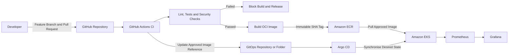

# Source-to-Production Flow

## Sources of Truth

- Application source: GitHub.
- Container artifacts: Amazon ECR.
- Deployment desired state: GitOps.
- Runtime platform: Amazon EKS.
- Monitoring evidence: Prometheus and Grafana.

## Release Rule

No image may be released or deployed unless required CI validation succeeds.